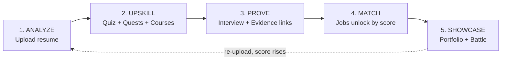
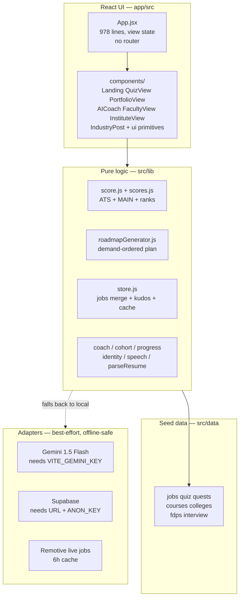
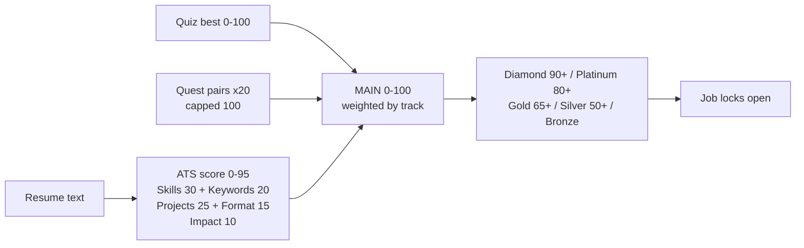

# C2C — Campus2Corporate: Exam-Ready PRD & Code Guide

**One line:** an internship portal with gamified upskilling — not just finding internships, but training for them, proving skills, and showcasing them to the world. Direction: one roof for jobs, people, clans, upskilling and verified proof.
**Stack:** Vite + React 19 + Tailwind v4 · no backend in Build 1 (browser + localStorage) · Supabase + Gemini 1.5 Flash as optional/planned adapters with offline fallbacks.
**Status:** `npm run build` passes · 48/48 tests GREEN (`node --test "tests/*.test.js"`) · oxlint 2 warnings.

---

## 1. The Problem Statement (PS) you gave

Transcribed from your notebook photo (Fri-11-Sep-2026):

> "Internship portal app with gamifying features. It's not just for finding internship opportunities but for up-skilling yourself in an interactive way and showcase your skills to the world. — C2C"

Feature list from the same page:

| # | Notebook item | Where it lives in the app |
|---|---------------|---------------------------|
| 1 | Profile Analyze | Score view → `scoreResume()` in `app/src/lib/score.js` |
| 2 | Suggest skill | Missing-skills list + `roadmapGenerator()` in `app/src/lib/roadmapGenerator.js` |
| 3 | Match internship & job | Jobs view → `matchJobs()` in `app/src/data/jobs.js`, gated by MAIN score |
| 4 | AI-Help bot | Floating `AICoach` (`app/src/components/AICoach.jsx` + `app/src/lib/coach.js`, `gemini.js`) |
| 5 | Skill showcase | Portfolio view (`app/src/components/PortfolioView.jsx`), shareable `?c2c=` link |
| 6 | Job search | Jobs view: search + type/location/eligibility filters + live Remotive feed |
| 7 | Sociable | Kudos + shared showcase + leaderboard battle (`app/src/lib/store.js`) |
| 8 | Recomm. career path | `rankRoles()` — scores your resume against all 4 tracks, suggests best fit |
| 9 | Online courses | `coursesFor()` in `app/src/data/courses.js` (free links per skill gap) |
| 10 | Mock interview | Interview view: role questions + voice answer + AI feedback + streak |
| 11 | Scoring System | ATS (0–95) + Quiz + Proof → MAIN (0–100), `app/src/lib/score.js` + `scores.js` |
| 12 | Leaderboard | Battle/college leaderboard, private by design (`app/src/data/colleges.js`) |
| 13 | Login / Unique ID | `getOrCreateC2CId()` → `C2C-XXXXXX` in `app/src/lib/identity.js` (no password) |
| 14 | Showcase in cool way | Portfolio: verified ticks, journey timeline, proof-backed projects, print/CV |

Every bullet on that page maps to real code. That is your strongest exam line: **"nothing on the PS page is a mockup."**

---

## 2. What it does (user-visible, in 5 steps)

1. **Analyze** — paste/upload resume → instant ATS score (0–95) with a 5-part breakdown + missing skills.
2. **Upskill** — daily quiz (10 questions), quest tree (learn + build project per skill), free course links for each gap, weekly roadmap ordered by real job demand.
3. **Prove** — mock interview (voice or typed), evidence URLs for quest projects, GitHub link, certificates.
4. **Match** — 35+ seed jobs plus live feed; each job has a `minScore`, locked jobs show what score unlocks them.
5. **Showcase** — public portfolio link (`?c2c=YOUR-ID`), verified-skill ticks, kudos from others, private college leaderboard battle.

Four login-free roles, one app: **Student** (the loop above) · **Industry** (post openings) · **Faculty** (FDP/workshop board) · **Institute** (cohort analytics + CSV export).

---

## 3. How it works — architecture

Design rule governing everything: **deterministic core, optional AI.** All scoring, matching, and roadmaps are pure functions that run offline. Gemini and Supabase are adapters — if keys/network are missing, local fallbacks answer instead and nothing crashes. That is why the app "works offline" and why it survives a flaky stage Wi-Fi.

---

## 4. The scoring system (the exam favourite — learn this cold)

### 4.1 ATS — `scoreResume()` (`app/src/lib/score.js:54-99`)

Keyword counting against a per-track rubric (`ROLES`, `score.js:2-23`). Four tracks: `sde`, `data`, `marketing`, `govt`, each with its own skills + keywords. Points: skills 30, keywords 20, sections/projects 25, format/contact 15, quantified impact 10. **Cap is 95, not 100** — deliberate headroom so re-uploading an improved resume always has somewhere to go (the retention loop). Under 50 characters → score 0 with a friendly message, never a crash. Quest-completed skills merge into your found set (capped so they can't break the metric).

### 4.2 MAIN — `calculateMainScore()` (`score.js:31-36`) via `combineScores()` (`scores.js:10-13`)

Tech tracks (`sde`, `data`): `MAIN = round(0.5·ATS + 0.3·Quiz + 0.2·Proof)`
Other tracks (`marketing`, `govt`): `MAIN = round(0.6·ATS + 0.3·Quiz + 0.1·Proof)`

Why the difference (say this in viva): tech hiring weights demonstrable proof (code, projects) more; non-tech weights resume content more. Quiz stands in for the PRD's voice-interview score in Build 1. Proof = `min(100, questPairs × 20)` — 5 verified quest projects = full proof.

**Worked example** (memorise): ATS 80, quiz 100, 5 quest pairs → proof 100.
Tech: 0.5·80 + 0.3·100 + 0.2·100 = 40+30+20 = **90 Diamond**.
Non-tech: 0.6·80 + 0.3·100 + 0.1·100 = 48+30+10 = **88 Platinum**.

### 4.3 Ranks gate jobs (`rankFor`, `score.js:39-45`)

Bronze <50 (roadmaps only) → Silver 50+ (entry internships) → Gold 65+ (competitive roles) → Platinum 80+ (spotlight) → Diamond 90+ (verified top-tier). `matchJobs()` filters by track, checks `score ≥ minScore`, sorts eligible-first by skill overlap.

---

## 5. Frontend — what we use and why

| Choice | Why (one line each) |
|--------|---------------------|
| Vite | Instant dev server + fast production build; `npm run build` done in ~1s |
| React 19 (JSX, no TypeScript) | Team reads JSX fluently; single-language codebase |
| Tailwind v4 (via `@tailwindcss/vite`) | Utility styling, no CSS files per component |
| No router | `view` state in `App.jsx` (home/jobs/score/quiz/quests/interview/battle/portfolio) — fewer deps, share-link handled via `?c2c=` param |
| `motion` micro-animations | Small vendored wrappers (`amicro.jsx`), reduced-motion safe |
| pdfjs-dist | In-browser PDF text extraction — **resume never leaves the browser** (privacy claim) |
| Web Speech API | Free voice input for interviews, no server needed |

Component map (`app/src/components/`): `Landing` (hero + funnel) · `QuizView` (10-of-20 seeded by `C2C-ID+day`, jump rail + review) · `PortfolioView` (own + shared read-only) · `AICoach` (floating drawer, 4 quick actions + free text) · `FacultyView` (FDP board + Interested shelf) · `InstituteView` (cohort KPIs + CSV export) · `IndustryPost` (post opening + applicant counts) · `RoleSwitch` + `ui` primitives (Button/Card/Badge/Field/Progress).

Known debt (say it before they find it): `App.jsx` is 978 lines — readable for a prototype, first candidate for extraction; oxlint flags `Date.now` in render and one set-state-in-effect.

---

## 6. Backend — what we use and why (short answer: almost none, by design)

Build 1 persists to **`localStorage` under `c2c-*` keys** — zero signup friction on stage, zero server cost, works offline:

| Key | Holds |
|-----|-------|
| `c2c-id` / `c2c-nick` / `c2c-github` / `c2c-certs` | Identity (Unique ID replaces login) |
| `c2c-role` | app role (student/industry/faculty/institute) |
| `c2c-progress-v1` | Quest ticks, evidence URLs, streak + badges |
| `c2c-quiz-{role}` | Best quiz score per track |
| `c2c-custom-jobs` / `c2c-applications` / `c2c-interests` | Posted jobs, applications, FDP interests |
| `c2c-live-jobs` | Remotive feed cache (6h, 8s abort timeout) |

Planned server pieces (schema already written in `UPDATES/MASTER_PRD_AND_PROMPT.md` §3, SQL in `supabase.sql`): Supabase tables `profiles`, `assessments`, `roadmaps`, `jobs`. Today `supabase.js` merges remote boards best-effort — no keys → seeds only, no error. Same pattern for Gemini (`gemini.js`, model `gemini-1.5-flash`): no key → `localAnswer()` in `coach.js` responds from live state. **Exam line:** "local-first with progressive enhancement — the cloud upgrades it, never gates it."

Honest caveat to volunteer: the pdfjs worker loads from a CDN, so "fully offline" needs that cached — flagged as the #1 stage risk in `teach/learning-records/0001`.

---

## 7. Data structures (one example each — enough for any "show me" question)

- **Job** (`data/jobs.js` + `seedJobsExtra.js`): `{id, role, title, company, loc, type, skills[], minScore, apply}` — 12 + 23 seeds. Ex: `{id:1, role:"sde", title:"Frontend Intern", company:"ZetaPay (Startup)", skills:["javascript","react","html","css","git"], minScore:40}`.
- **Quiz** (`data/quiz.js`): 20 questions × 4 tracks, `{q, opts[4], ans}`; `quizSample(role,id,day)` picks 10 deterministically so everyone gets a fresh-but-fair daily set.
- **Quests** (`data/quests.js`): tree per track → branches → skills, each with `{course:{t,u}, project}`; `pickForId` hashes student-ID so variants differ per student (anti-copying).
- **Courses** (`data/courses.js`): free link per skill + 3 project ideas per track.
- **Cohort/FDP/Interview/Colleges**: 24 demo students · 12 FDPs (3 per kind) · 5 interview Qs per track · college averages recomputed by `avg=(avg·members+you)/(members+1)`.
- **Roadmap** (`roadmapGenerator.js`): counts skill frequency across open jobs (`jobDemand`), sorts your gaps by demand, emits week plans as learn-task + build-task + resume-task, week 1 leading with the most-asked skill "asked in N open roles".

---

## 8. Quality proof (numbers examiners trust)

- **Tests:** 10 files in `app/tests/`, 48 tests, all GREEN — pure `node:test`, no framework: ATS rubric, MAIN weights incl. PRD §4.1 pins, proof mapping (0→0, 3→60, 5+→100), quiz grading/sampling, quest hashing, job matching/sorting/dedupe, roadmap demand order, cohort stats + CSV, portfolio identity/kudos, faculty interests.
- **TDD rule active:** RED (failing test) → GREEN (minimal fix) → refactor, checkpoint commits per stage.
- **Coding standards active:** descriptive names, immutability (spread, no push/mutate), early returns, <50-line functions.
- **Build/lint:** `npm run build` clean (~1s); `npm run lint` 2 warnings (both in `App.jsx`, scheduled with its extraction).

---

## 9. Plans (what's next — ranked)

**Must-do before submission:** vendor the pdfjs worker locally (kills the offline risk) · split `App.jsx` (views → files, keeps standards green) · wire one Supabase table live (battle leaderboard first — biggest demo payoff) · add coverage threshold to lock the 80% bar.
**Nice-to-have:** real voice grading via Gemini on the interview transcript · public portfolio SEO · employer dashboard beyond counts · push the 6-phase agent plan in `MASTER_PRD_AND_PROMPT.md` §5 (contracts → parser → voice → roadmap → coach → jobs) which was written exactly for parallel builders.
**Never (deliberately killed):** public leaderboard with names (privacy — private battle only), password auth (Unique ID is the login).

**Platform pillars (the one-roof direction):** single-player loop above ships first; social and marketplace layers follow in this order:

| Pillar | Status | Note |
|--------|--------|------|
| Auto roadmap + todo list | Exists (`roadmapGenerator.js`; todos = quest ticks in `c2c-progress-v1`) | Streaks already wired |
| Mock tests + cert skill tests with badges | Planned | Auto-graded tests scale; badge scarcity is what makes them worth grinding |
| XP system | Planned | XP only for verified actions (evidence URL, test pass), never for clicks |
| Portfolio-as-profile (certs, GitHub, LeetCode) | Exists (`PortfolioView.jsx`) | Differentiator is the verified layer, not more profile fields |
| Leaderboard | In discussion | Clan-vs-clan and seasons beat a global solo ladder (bottom-80% quit) |
| Clans + chat | Planned | Moderation story required before DMs (wordlist + reporting minimum) |
| Company squad-hire | Planned | Verified skill-composed teams, the sharp edge over individual search |
| Freebies + notifications digest | Planned | Pull digest, not push spam; partnerships, not scraping |

---

## 10. Viva cheat-sheet (if asked X, say Y)

1. **"What problem does this solve?"** — Students can't prove skills; C2C turns a resume into a verified, improvable score linked to real openings.
2. **"Why gamified?"** — the 95-cap + battle + streaks make users act (re-upload, finish quests); action-taking is the metric, not browsing.
3. **"Why no backend yet?"** — local-first = zero-friction demo + offline-safe; Supabase schema is written and merges best-effort when keys exist.
4. **"Why is ATS capped at 95?"** — intentional headroom driving the re-upload improvement loop.
5. **"Why different MAIN weights per track?"** — tech hiring values proof-of-work more; non-tech values resume content more.
6. **"How do you stop fake scores?"** — proof needs evidence URLs + quiz is seeded per-ID-per-day + quest variants hash per student; GitHub/cert verification ticks on portfolio.
7. **"Privacy?"** — resume text never leaves the browser; leaderboard shows aggregates, never PII.
8. **"Scale to 1 lakh students?"** — pure functions + static hosting scale horizontally; only leaderboard/applications need Supabase, schema ready.
9. **"Biggest weakness?"** — pdfjs CDN worker for true offline; fix is vendoring it locally (top of backlog).
10. **"What did YOU build vs libraries?"** — all scoring/matching/roadmap logic is ours (~15 lib files); Vite/React/Tailwind/pdfjs/Web-Speech are infrastructure.

## Glossary

ATS (resume keyword score 0–95) · MAIN (combined readiness 0–100) · Proof (quest-verified skill evidence 0–100) · Quest pair (course + project + evidence URL) · Battle (private college leaderboard) · C2C-ID (password-free unique identity) · Track (sde/data/marketing/govt career line) · XP (points for verified actions only) · Clan (skill group with shared chat) · Badge (scarce, test-earned proof worth showcasing).
