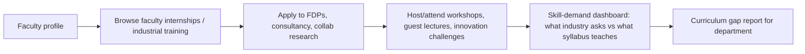
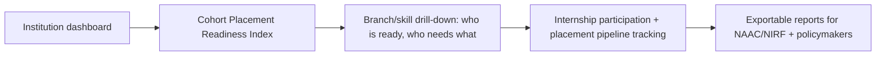
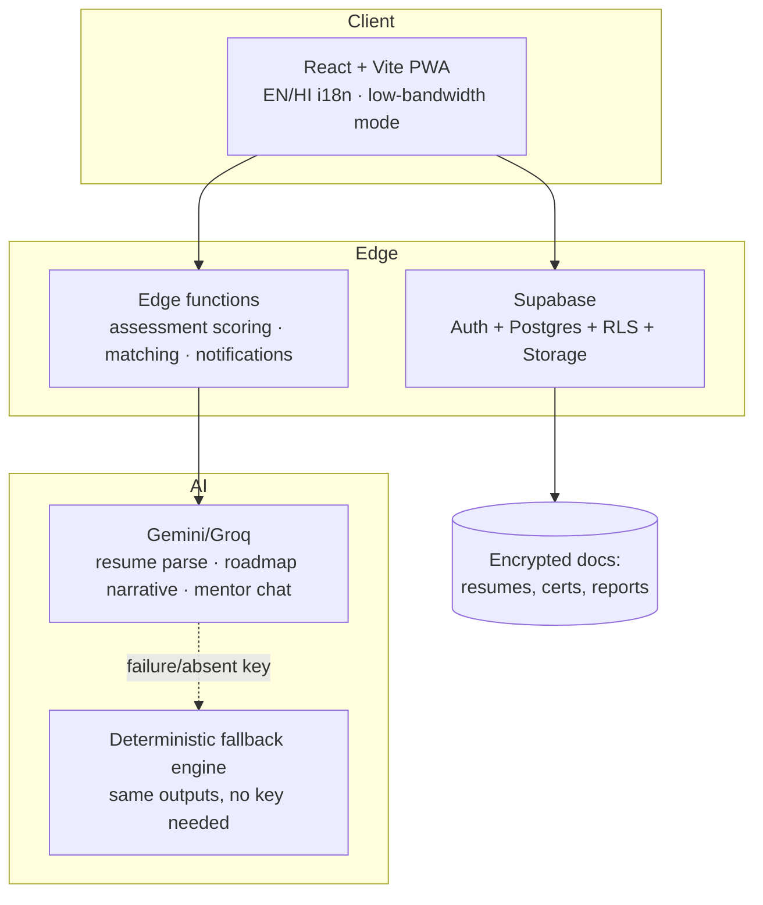
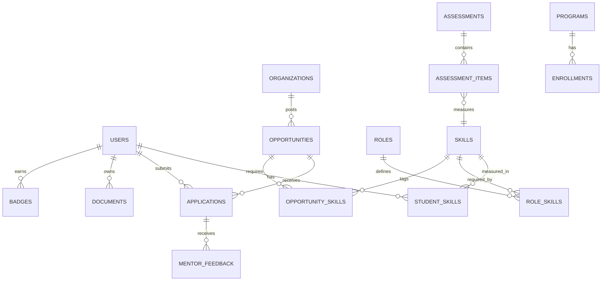

# SIH 26044 — Winning Strategy
## Academia–Industry Collaboration Portal for Skill Mapping, Internships & Placement
**Org:** Ministry of Ayush — All India Institute of Ayurveda · **Theme:** Smart Automation

---

## 1. The Core Insight (read this first)

Every team will build "LinkedIn for colleges" — postings, applications, dashboards. That is table stakes, and 40 other teams in your room will demo exactly that.

The PS title says the real problem: **Skill Mapping**. The winner is the team whose platform can answer, with numbers and evidence, three questions for every stakeholder:

| Stakeholder | Question they desperately want answered |
|---|---|
| Student | "What exactly am I missing for the job I want, and how do I close it?" |
| Industry | "Show me candidates ranked by *proven* skill fit, not keyword resumes." |
| Academician | "What should I teach differently, and where do I get industry exposure?" |
| Institution | "How placement-ready is my cohort, branch by branch, right now?" |

So the entire product is built around one engine — **the Skill Graph Engine** — and every feature (assessment, matching, portfolio, analytics, FDPs) is just a view on top of it. That is the story. One engine, four portals.

**The Ayush wedge:** the sponsoring ministry is Ayush. Seed the demo with AYUSH-sector data (BAMS/BSMS students, herbal pharma QA roles, Ayurvedic clinical research, wellness tourism, medicinal plant cultivation, AYUSH drug manufacturing GMP). Generic platform, ministry-flavored demo. Judges from the ministry will remember the one team that spoke their language.

---

## 2. What loses vs. what wins

| What losing teams do | What we do instead |
|---|---|
| Hardcoded "recommended jobs" list | Explainable match score: `fit = f(skill overlap, proficiency gap, recency, evidence)` — shown to the user with a breakdown |
| Quiz that says "you scored 7/10" | Assessment maps answers → skills → proficiency levels on a published taxonomy (NSQF/NCrF-aligned), producing a radar chart vs. the target role |
| Resume upload + parse | Resume → extracted skills → *verified vs. self-claimed* split, with evidence links and revocation |
| Dashboards with vanity charts | Placement Readiness Index per student/branch/institution + skill-demand heatmap for policymakers |
| AI chatbot gimmick | AI does 4 concrete jobs: assessment generation, resume parsing, gap-roadmap generation, interview/mentor prep — each with an offline deterministic fallback so the demo never dies |
| Generic e-commerce-style polish | India-context wins: bilingual (EN/HI), PWA low-bandwidth mode, NEP 2020 alignment slide, DigiLocker-style verifiable credentials |
| 1.5 working roles at demo time | All 4 roles fully seeded and clickable, one rehearsed end-to-end story |

---

## 3. Product definition

**Name (suggestion):** `SetuBandhan` / `SkillSetu` — "bridge" between academia and industry. One name, one sentence: *"The skill graph that connects classrooms to careers."*

### Four portals, one engine

```
┌─────────────┐  ┌──────────────┐  ┌─────────────┐  ┌───────────────┐
│   STUDENT   │  │ ACADEMICIAN  │  │  INDUSTRY   │  │  INSTITUTION  │
│  assessment │  │ FDP / faculty│  │ post roles  │  │ readiness     │
│  roadmap    │  │ internships  │  │ shortlist by│  │ dashboards    │
│  portfolio  │  │ consultancy  │  │ skill fit   │  │ heatmaps      │
│  apply+track│  │ collab R&D   │  │ programs    │  │ reports       │
└──────┬──────┘  └──────┬───────┘  └──────┬──────┘  └───────┬───────┘
       └────────────────┴────────┬────────┴─────────────────┘
                                  ▼
                    ┌──────────────────────────┐
                    │     SKILL GRAPH ENGINE    │
                    │ taxonomy · assessment ·   │
                    │ gap analysis · matching · │
                    │ verification · analytics  │
                    └──────────────────────────┘
```

---

## 4. The Skill Graph Engine (the heart — get this right)

This is what you whiteboard for judges. Everything else is CRUD.

### 4.1 Skill taxonomy
- Hierarchical: `Domain → Role → Skill → Proficiency (L1 Aware → L2 Beginner → L3 Practitioner → L4 Advanced → L5 Expert)`.
- Seeded with ~60 skills across 8 domains, including an AYUSH domain (e.g. *Dravyaguna identification, Panchakarma protocols, GMP for ASU drugs, herbal formulation QA, AYUSH clinical trial documentation*) alongside CS/IT, Data, Design, Marketing, Core Engg.
- Each skill carries: aliases, related skills, decay half-life (skills go stale), demand weight (editable by industry postings), and the NSQF level it maps to.
- Stored as a table, not hardcoded — industry can propose new skills; admin approves. Judges love "the taxonomy evolves with industry."

### 4.2 Assessment → Skill Profile
- Two instruments: **adaptive questionnaire** (scenario-based items, each item tagged to skills + difficulty) and **aptitude test** (timed, scored).
- Scoring per skill: weighted item response → proficiency level with confidence %, not a bare number.
- Output: radar/spider chart of the student's profile, strengths, and — the money shot — **gap vector vs. a target role**.

### 4.3 Gap analysis → Roadmap
```
targetRole.requiredSkills  −  student.verifiedSkills  =  gap vector
gap vector → ranked learning path (courses, certs, workshops, mentorships)
           → each step tagged with: provider, est. hours, which gap it closes
```
- AI generates the narrative ("You are L2 in Pharmacovigilance; roles you want need L4. Here is a 6-week path…"), deterministic engine generates the structure. **If the LLM key is absent, the deterministic path still renders** — demo-proof.

### 4.4 Matching score (used for internships, jobs, and shortlisting)
```
matchScore = 0.45 * skillCoverage        (fraction of required skills held)
           + 0.25 * proficiencyFit        (how close levels are to requirement)
           + 0.15 * verifiedRatio         (verified vs self-claimed)
           + 0.10 * recencyOfEvidence     (skill used recently)
           + 0.05 * interestAlignment     (assessment interests vs role tags)
```
Weights visible on an "How we match" page. Explainability beats cleverness at SIH. Industry sees the same score with a per-candidate breakdown for shortlisting.

### 4.5 Verification layer
- Skills enter the profile as **self-claimed**; they become **verified** only via: passed platform test, certificate upload + issuer check, completed internship with mentor sign-off, or project evidence with ownership check (e.g. GitHub handle must match).
- Verified skills get a badge + QR-verifiable credential page (signed token, `/verify/:id` public route). Revoked credentials stay visible as revoked — integrity theater that judges remember.

---

## 5. Role flows (one diagram per role — put these in the PPT)

### 5.1 Student

```mermaid
flowchart LR
    A[Sign up] --> B[Onboarding: interests + target roles]
    B --> C[Adaptive assessment + aptitude test]
    C --> D[Skill profile + radar chart]
    D --> E[Gap analysis vs dream role]
    E --> F[Personalized roadmap: courses, certs, workshops]
    F --> G[Match-scored internships/jobs feed]
    G --> H[1-click apply with portfolio]
    H --> I[Track application pipeline]
    I --> J[Complete internship → mentor feedback → verified skill]
    J --> K[Public QR-verifiable digital portfolio]
    K -.new target role.-> E
```


### 5.2 Industry

```mermaid
flowchart LR
    A[Register + KYC verify] --> B[Post internship / job / apprenticeship]
    B --> C[Attach required skills + levels from taxonomy]
    C --> D[Publish learning program / workshop / mentorship]
    D --> E[Inbound applications auto-ranked by matchScore]
    E --> F[Shortlist with skill-fit breakdown]
    F --> G[Offer → mentor assignment → progress tracking]
    G --> H[Completion record → verifies student skills]
    H --> I[Analytics: funnel, skill supply trends]
```


### 5.3 Academician


### 5.4 Institution (placement cell / admin)


---

## 6. Requirement → Feature traceability (judge checklist)

Print this as a slide. Every PS bullet maps to a working screen.

| PS requirement | Our feature | Screen |
|---|---|---|
| Skill assessment via questionnaire/aptitude | Adaptive engine + timed aptitude | `/assess` |
| Skill profiling + gap identification | Radar chart + gap vector | `/profile/skills` |
| Skill mapping → roles/programs | Match-scored role & program recs | `/pathways` |
| Personalized learning recs | Deterministic roadmap + AI narrative | `/roadmap` |
| Career guidance | AI mentor (with offline fallback) | `/coach` |
| Digital portfolio, verified | Public QR-verifiable portfolio | `/u/:handle` |
| Centralized internship portal | Postings w/ skill requirements | `/opportunities` |
| Matching students ↔ internships | matchScore feed + 1-click apply | `/opportunities` |
| Application tracking | Pipeline board (Applied→Shortlist→Offer→Complete) | `/applications` |
| Faculty internships, FDPs, consultancy, research | Dedicated academician portal | `/faculty` |
| Progress, mentor feedback, completion records | Internship workspace + sign-off | `/workspace/:id` |
| Job posting + shortlisting | Recruiter console w/ ranked candidates | `/recruit` |
| Placement analytics | Readiness Index + heatmaps | `/analytics` |
| Role-based access (4 roles) | Supabase RLS + role guards | auth |
| Secure document management | Encrypted storage, signed URLs | `/documents` |
| Collaboration: mentorship, live projects, workshops, challenges | Programs module + innovation challenges | `/programs` |
| Integration w/ learning platforms | Provider links + cert import hooks | `/integrations` |
| Policymaker analytics | Skill demand heatmap by region/sector | `/analytics/policy` |

---

## 7. Architecture



**Stack (final):** React + Vite + Tailwind (PWA), Supabase (auth, Postgres, RLS, storage), edge functions for scoring/matching, Gemini with a deterministic local fallback for every AI feature. Recharts/D3 for dashboards. `react-pdf` for portfolio export.

**Why this stack, said out loud to judges:** zero server ops, RLS gives role-based security at the DB layer (not app-layer promises), free tier scales through the hackathon and a pilot, and every AI feature degrades gracefully offline — the platform never hard-depends on connectivity or a paid API.

### Core schema

Key tables: `users(role)`, `skills(parent_id, nsqf_level, aliases, demand_weight)`, `student_skills(skill_id, level, confidence, verified, evidence_url, verified_by, revoked)`, `opportunities(type: internship|job|apprenticeship|fdp|consultancy|research)`, `applications(status pipeline)`, `assessments/items/responses`, `programs/enrollments`, `documents(signed_url)`, `audit_log`.

---

## 8. Innovation stack (USPs mapped to judging criteria)

| Judging criterion | Our answer |
|---|---|
| Innovation | Explainable skill graph + proficiency decay + verified-vs-claimed skill split; Ayush-seeded taxonomy |
| Feasibility | Working demo of all 4 roles; boring-proven stack; no unbuildable promises |
| Scalability | Stateless edge functions, Postgres RLS, taxonomy-as-data (new sectors = seed rows, not code) |
| Social impact | NEP 2020 + NCrF alignment, rural/low-bandwidth PWA, Hindi UI, AYUSH sector visibility, policymaker heatmaps |
| Technical depth | Adaptive assessment scoring, matching engine with published weights, signed verifiable credentials, AI with deterministic fallback |
| Completeness | Traceability matrix slide: every PS bullet → a live screen |

**NEP 2020 talking point (memorize):** "NEP mandates industry-linked learning and multiple exit-entry with skill credits. Our taxonomy maps to NCrF levels, so a completed internship can translate into academic credit. We are the operational layer NEP 2020 never shipped."

---

## 9. 36-hour build roadmap (team of 6)

### Roles
- **P1 — Engine lead:** taxonomy, assessment scoring, gap analysis, matching (pure functions + tests).
- **P2 — Student portal:** assessment UI, radar chart, roadmap, applications pipeline.
- **P3 — Industry + Faculty portals:** posting forms, recruiter console, FDP/research listings.
- **P4 — Backend:** schema, RLS policies, seed data, storage, edge functions.
- **P5 — AI + verification:** Gemini adapters, fallbacks, resume parser, credential signing + `/verify`.
- **P6 — Design + pitch + institution dashboard:** UI system, analytics charts, PPT, demo script, video.

### Timeline
| Hours | Milestone |
|---|---|
| 0–3 | Repo, auth + 4 roles, schema deployed, taxonomy seeded (incl. AYUSH domain), design tokens |
| 3–8 | Assessment engine + UI working end-to-end (hardcoded items ok), radar chart renders |
| 8–13 | Matching engine + opportunities feed + apply; recruiter console ranking |
| 13–18 | Roadmap generator (deterministic) + AI narrative; applications pipeline; portfolio page |
| 18–23 | Faculty portal (FDP/internship/research); institution dashboard (Readiness Index, heatmap); documents + verification + `/verify` QR |
| 23–28 | Mentor feedback + completion → skill verification loop; AI mentor; bilingual toggle; PWA polish |
| 28–33 | **Feature freeze.** Seed the full demo story, fix bugs, rehearse the 3-minute run 5+ times |
| 33–36 | PPT final, backup video recording, offline fallback drill (unplug WiFi, demo still works), sleep in shifts |

### Demo-seed story (the script the seed data must tell)
> **Ananya**, a BAMS final-year student, wants "Clinical Research Associate — Ayush." Her assessment shows L2 in GCP documentation vs required L4, strong in Dravyaguna. Roadmap: 2 certs + 1 workshop. She applies to an internship at **Charak-style herbal pharma**, match 87%. Recruiter shortlists her with the fit breakdown. Completes it, mentor signs off, GCP skill flips to verified. Institution dashboard updates her branch's readiness. Faculty mentor Dr. Rao finds an industry FDP on the same platform. One seed story, four logins, zero dead clicks.

### Cut list (decided now, not at hour 30)
Real messaging/chat, payments, video interviews, mobile native app, live job-board scraping, more than 2 languages, admin CMS beyond skill approval.

---

## 10. Pitch & demo strategy

**3-minute demo flow (rehearse word-for-word):**
1. 0:00 — Problem in one line + Ayush framing: "India graduates 1.5 crore students a year into a market that can't read their skills. The ministry asked for a bridge. We built the skill graph that is that bridge."
2. 0:20 — Student: assessment → radar → gap vector → roadmap (the wow moment: the gap analysis breakdown).
3. 1:00 — Match feed with score breakdown; apply in one click.
4. 1:20 — Recruiter side: ranked shortlist, per-candidate fit explanation. Say "no black box."
5. 1:45 — Verify: scan QR on portfolio → signed credential page. Say "skills you can trust."
6. 2:05 — Institution: readiness index + skill heatmap; policymaker view.
7. 2:25 — Faculty portal in 20 seconds (FDP + research collab) — proves we covered the forgotten stakeholder.
8. 2:45 — Architecture slide: graceful AI fallback, RLS security, NEP alignment. Close with the one-engine-four-portals line.

**PPT skeleton (10 slides):** Problem w/ numbers → Solution one-liner → Skill Graph Engine (the diagram) → Live demo screenshots ×3 → Matching math slide → Verification & trust → Architecture → Ayush + NEP alignment → Impact & scalability → Roadmap (credit bank integration, DigiLocker, more sectors).

### Judge Q&A prep
- **"How is this different from LinkedIn/NCS/internshala?"** — They match on resumes and keywords; we match on a verified proficiency graph, and we close the loop: assessment → learning → internship → verified skill → placement, with institutions and faculty as first-class citizens. NCS has no skill-gap engine; Internshala has no verification or faculty portal.
- **"What if the AI fails / no internet?"** — Every AI output has a deterministic fallback; the PWA works offline for cached views. Demo it live.
- **"How do you prevent fake skills?"** — Four verification paths + revocation that stays publicly visible + evidence ownership checks.
- **"How does the taxonomy stay current?"** — Industry-proposed skills with admin approval; demand weights auto-derived from live postings.
- **"Data privacy?"** — RLS at the database, signed URLs for documents, consent-gated portfolio visibility, audit log.
- **"Business model?"** — Free for students/institutions (govt. deployment via ministry), industry pays for premium shortlisting analytics and program promotion; certification-provider revenue share.

---

## 11. Risks & fallbacks

| Risk | Mitigation |
|---|---|
| Scope explosion kills the demo | Cut list frozen at hour 0; engine + student + recruiter are must-ship, faculty/institution are second wave but seeded |
| Gemini API dies mid-demo | Deterministic fallback for every AI feature; pre-recorded backup video |
| Supabase free-tier hiccup | Local seed script can rebuild the entire demo DB in one command |
| Judges are non-technical (ministry panel) | Lead with the Ananya story, not the architecture; keep the math slide optional |
| Team burnout | Feature freeze at hour 28 is non-negotiable; sleep in shifts from hour 24 |

---

## 12. The one-sentence version

> **We didn't build another job board. We built the skill graph that measures what students can actually do, verifies it, and closes the loop between classrooms, faculty, and industry — explainably, offline-proof, and aligned with NEP 2020 — demonstrated live on the Ayush sector the ministry cares about.**

Win the demo with the gap-analysis moment. Win the Q&A with the fallback and the traceability matrix. Win the room with the Ayush story.


#what chat gpt gaved me the strat is here 

This is essentially a **three-sided employability + collaboration platform**: students, academia, and industry. For a hackathon, I would avoid building 50 disconnected features and instead build one very strong core loop:

> **Assess → Identify gaps → Recommend → Learn → Apply → Track → Verify → Improve**

That gives you a product that feels like an actual system rather than a job portal with extra dashboards.

## 1. The product I'd build

Call it something like **SkillBridge**, **AyuBridge**, or **KaushalConnect**.

### Core idea

Every student gets a **dynamic Skill Passport**.

Instead of:

> "Student has CSE degree + 7.8 CGPA"

the platform says:

> **Student → Frontend Developer**
>
> React: 78%
> JavaScript: 71%
> HTML/CSS: 91%
> Git: 63%
> Communication: 74%
>
> **Industry readiness: 72%**
>
> Missing:
>
> * TypeScript
> * REST APIs
> * Testing
>
> Recommended:
>
> * 2 learning programs
> * 3 internships
> * 1 live project

That becomes the central object around which the entire platform operates.

---

# 2. Don't build everything

The problem statement is huge.

You could technically build:

* assessment
* skill mapping
* learning
* internships
* jobs
* faculty programs
* research
* mentorship
* workshops
* portfolios
* institution analytics
* recruiter dashboard
* document management
* certification
* etc.

**Don't.**

For a hackathon MVP, I'd make these 5 modules extremely polished:

### ① Skill Assessment

### ② Skill Intelligence / Gap Analysis

### ③ Opportunity Matching

### ④ Skill Passport

### ⑤ Institution + Industry Analytics

Everything else can exist as lightweight supporting functionality.

---

# 3. The killer feature: Skill Graph

This is where I'd differentiate the project.

Don't treat skills as a simple list.

Create a **Skill Graph**.

For example:

```text
                    FRONTEND ENGINEER
                           │
             ┌─────────────┼─────────────┐
             ↓             ↓             ↓
        JavaScript       React        Web APIs
             │             │             │
        ┌────┴────┐        ↓             ↓
        ↓         ↓    Components      REST
     ES6+       Async       │             │
                             ↓             ↓
                           Projects     Integration
```

Industry defines the required skill graph for a role.

Student has their own skill graph.

Your system calculates:

```text
Student Skill Graph
        +
Industry Skill Graph
        ↓
   Compatibility
        ↓
    Skill Gaps
        ↓
Learning / Internship recommendations
```

Now the "AI" actually has a purpose.

---

# 4. Student experience

The student dashboard should immediately answer:

### "Where am I?"

```text
┌─────────────────────────────────────────────┐
│ GOOD MORNING, DEVANSH                       │
│                                             │
│ Career Target                              │
│ Frontend Engineer                           │
│                                             │
│ Industry Readiness                          │
│ ████████████████░░░░  78%                  │
│                                             │
│ 3 critical skill gaps                       │
│                                             │
│ JavaScript       ███████████████░ 78%       │
│ React            ████████████░░░░ 61%       │
│ Git              █████████████░░░ 68%       │
│ APIs             ████████░░░░░░░░ 42%       │
└─────────────────────────────────────────────┘
```

Then:

### Recommended for you

```text
INTERNSHIPS

Frontend Intern
₹15k/month
92% skill match

React Developer Intern
₹20k/month
84% skill match

Web Development Intern
₹10k/month
79% skill match
```

And:

### Your next move

```text
Improve REST APIs
      ↓
Complete "REST API Fundamentals"
      ↓
Build API Integration Project
      ↓
Skill verification
      ↓
Unlock 14 additional opportunities
```

That's a much more compelling UX than:

> "Here are 200 internships."

---

# 5. Assessment system

Don't make it a boring MCQ exam.

Have 4 dimensions:

### Technical

```text
Programming
Web Development
Database
Cloud
AI/ML
Cybersecurity
etc.
```

### Aptitude

```text
Logical reasoning
Quantitative
Problem solving
Data interpretation
```

### Soft skills

```text
Communication
Teamwork
Leadership
Adaptability
Presentation
```

### Career interests

Ask:

> Which type of work do you enjoy?

and scenario questions such as:

> You're given a broken website. What would you do first?

This gives you both **skill level + interest**.

---

# 6. AI Skill Analyzer

This is where an LLM can be useful.

Student uploads:

* resume
* GitHub
* certificates
* projects
* assessment results

The system extracts:

```json
{
  "skills": [
    {
      "name": "JavaScript",
      "level": 72,
      "evidence": [
        "E-commerce project",
        "React portfolio"
      ]
    }
  ]
}
```

But **don't let the LLM simply invent skill levels**.

Use evidence.

For example:

```text
Skill
   ↓
Assessment ───────┐
                  │
Projects ────────►│
                  ├──► Skill Confidence
Certificates ────►│
                  │
GitHub ───────────┘
```

Then display:

> **React — 78%**
>
> Evidence:
> ✓ Assessment
> ✓ 2 projects
> ✓ GitHub activity

This makes your AI more credible.

---

# 7. Opportunity matching

This should be your second major algorithm.

Suppose:

### Internship requires

```text
React       80
JavaScript  70
Git         60
APIs        60
```

Student:

```text
React       75
JavaScript  82
Git         68
APIs        45
```

Your system calculates compatibility.

For example:

```text
Skill compatibility       74%
Eligibility                100%
Career interest             90%
Location preference         80%
Experience                  70%

────────────────────────────

Overall Match               79%
```

Then:

### Why you matched

> ✓ Strong JavaScript foundation
> ✓ Git requirement satisfied
> ⚠ REST API knowledge is below requirement

This **explainability** is important.

Don't just show:

> 79% match

Explain **why**.

---

# 8. Opportunity cards

Make them more intelligent than normal job boards.

```text
┌─────────────────────────────────────────┐
│ FRONTEND ENGINEERING INTERN              │
│ Acme Technologies                       │
│                                         │
│ ₹15,000 / month · 6 months              │
│                                         │
│ YOUR MATCH                              │
│ ██████████████████░░  89%               │
│                                         │
│ ✓ JavaScript                            │
│ ✓ React                                 │
│ ✓ Git                                   │
│ ⚠ REST APIs — Gap                       │
│                                         │
│ [ VIEW OPPORTUNITY ]                    │
└─────────────────────────────────────────┘
```

The platform should explain:

> **You are 1 skill away from being highly compatible.**

That's a great product moment.

---

# 9. Skill Passport

This could become the centerpiece of your demo.

Instead of a static resume:

## Skill Passport

```text
DEVANSH DHANGAR
Frontend / Software Development

INDUSTRY READINESS
78%

TECHNICAL SKILLS

JavaScript       ●●●●○
React            ●●●○○
HTML/CSS         ●●●●●
Git              ●●●●○
Node.js          ●●○○○

VERIFIED

✓ React Project
✓ JavaScript Assessment
✓ Web Development Certificate
✓ Internship

PROJECTS

E-commerce Platform
Portfolio System
AI Dashboard

EXPERIENCE

Frontend Intern
```

Give each skill an **evidence badge**.

That solves one of the biggest problems with resumes:

> Anyone can write "React — Advanced."

Your platform asks:

> **What proves it?**

---

# 10. Industry portal

Industry shouldn't just post jobs.

Give companies:

### Create opportunity

```text
ROLE
Frontend Engineering Intern

REQUIRED SKILLS

React        ████████
JavaScript   ███████
Git          ██████
REST APIs    ██████

MINIMUM

CGPA         6.0
Experience   0 years
```

Then automatically generate:

### Candidate pool

```text
127 candidates found

89%+ match     14
80–89%         37
70–79%         52
<70%           24
```

Recruiter can see:

> **Why is this candidate matched?**

rather than simply filtering by CGPA.

---

# 11. Academia dashboard

This is where you satisfy the **institution** requirement.

The institution gets:

```text
INSTITUTION SKILL ANALYTICS

Students assessed       2,430

Industry readiness      64%

TOP SKILL GAPS

1. Cloud Computing       61%
2. Data Structures       54%
3. Communication         47%
4. Git                    43%
5. SQL                    38%
```

Then:

### Industry demand vs student supply

```text
                 Demand       Supply

Cloud             ██████████   ████
AI/ML             █████████    █████
Cybersecurity     ████████     ██
Web Development   ███████      ███████
Data Analytics    █████████    ████
```

Now the college can make decisions like:

> "Our students have a large cloud-skills gap. Let's introduce an AWS workshop."

That's much closer to **academia–industry collaboration**.

---

# 12. Industry demand intelligence

I'd add a second graph:

### Skills employers are asking for

```text
JUL → SEP 2026

React       ↑ 18%
Python      ↑ 14%
AWS         ↑ 31%
SQL         ↑ 12%
Java        ↓ 4%
```

The institution can see:

> **Emerging skill: Cloud Infrastructure**

and respond with:

> Create workshop → Invite industry mentor → Track student completion

This directly connects **industry demand → education → employability**.

---

# 13. Faculty portal

Don't build an entirely separate product.

Reuse the same opportunity engine.

Change the opportunity types:

```text
FOR FACULTY

Industrial Training
Faculty Internship
FDP
Consultancy
Research Collaboration
Guest Lecture
Industry Mentorship
```

For example:

```text
AI Industry Research Collaboration

Required:
• Machine Learning
• Python
• Research methodology

Suitable faculty:
12

[ VIEW MATCHED FACULTY ]
```

Same engine. Different user role.

---

# 14. Collaboration layer

You can have:

```text
Industry
   │
   ├── Mentorship
   ├── Live Projects
   ├── Workshops
   ├── FDP
   ├── Research
   └── Guest Lectures
            │
            ↓
       Institution
            │
            ↓
         Students
```

And track:

```text
Workshop
   ↓
Attendance
   ↓
Assessment
   ↓
Skill improvement
   ↓
Certification
   ↓
Internship eligibility
```

This makes the platform a **closed loop**.

---

# 15. The AI layer

Don't slap a chatbot on the homepage and call it AI.

I'd use AI in 4 places.

### AI #1 — Skill extraction

Resume + projects + certificates → structured skills.

### AI #2 — Skill-gap reasoning

Student skills vs desired role → explain gaps.

### AI #3 — Opportunity matching

Student ↔ internship ↔ job ↔ learning program.

### AI #4 — Career copilot

Student can ask:

> "Why am I not getting shortlisted?"

AI:

```text
Based on your profile:

Your strongest areas:
✓ JavaScript
✓ HTML/CSS
✓ Git

Most common missing requirements:
1. REST APIs
2. TypeScript
3. Testing

Improving these three skills would make
you compatible with 23 additional opportunities
currently available on the platform.
```

That's useful AI.

---

# 16. Architecture

For a hackathon, **don't overengineer microservices.**

I'd use:

```text
                    FRONTEND
                       │
              React / Next.js
                       │
                       ↓
                    API
                       │
          ┌────────────┼────────────┐
          ↓            ↓            ↓
       Auth        Core API       AI Layer
          │            │            │
          │            ↓            ↓
          │       PostgreSQL      LLM API
          │            │
          │            ↓
          │       Skill Engine
          │            │
          │      ┌─────┴──────┐
          │      ↓            ↓
          │  Matching      Analytics
          │
          ↓
       Storage
```

### Stack I'd personally choose

**Frontend**

* Next.js
* TypeScript
* Tailwind
* shadcn/ui
* Recharts

**Backend**

* Next.js API routes / Node
* PostgreSQL
* Prisma

**Auth**

* Clerk / Auth.js / Supabase Auth

**Storage**

* Supabase Storage / S3

**AI**

* OpenAI API or another LLM

**Search**

* PostgreSQL full-text initially
* pgvector if you need semantic matching

You don't need Kubernetes, Kafka, 12 microservices, etc. for the prototype.

---

# 17. Database

Your core schema can be surprisingly small.

```text
User
 ├── StudentProfile
 ├── FacultyProfile
 ├── IndustryProfile
 └── InstitutionProfile

Skill
 ├── SkillCategory
 └── SkillRelationship

StudentSkill
 ├── skill
 ├── proficiency
 ├── confidence
 └── evidence

Assessment
 └── AssessmentResult

Opportunity
 ├── Internship
 ├── Job
 ├── FDP
 ├── Research
 └── Workshop

OpportunitySkill

Application
 ├── Student
 ├── Opportunity
 └── Status

LearningProgram

Certification

Project

Portfolio

Mentorship

Collaboration
```

---

# 18. Most important database relationship

This is the heart:

```text
              ┌─────────────┐
              │    Skill    │
              └──────┬──────┘
                     │
          ┌──────────┴──────────┐
          ↓                     ↓
   StudentSkill          OpportunitySkill
          │                     │
          ↓                     ↓
       STUDENT              INDUSTRY
          │                     │
          └──────────┬──────────┘
                     ↓
              MATCHING ENGINE
                     ↓
               MATCH SCORE
```

Everything else grows from this.

---

# 19. Verification

This is an underrated feature.

Have three levels:

### Self-declared

> "I know Python."

### Assessed

> Assessment score: 82%

### Verified

> ✓ Industry project
> ✓ Faculty verified
> ✓ Certification

Then show:

```text
PYTHON

82% proficiency
████████████████░░░░

✓ Assessment verified
✓ Project verified
```

That makes the Skill Passport much more valuable.

---

# 20. The demo I'd give judges

This is **very important**.

Don't spend 5 minutes explaining dashboards.

Tell a story.

### Scene 1 — Student

> "I'm a second-year student. I want a software internship, but I don't know what I'm missing."

Take assessment.

↓

Platform creates Skill Passport.

↓

### Scene 2 — Gap detection

```text
Target: Full Stack Developer

Current readiness: 67%

Missing:
REST APIs
Testing
Docker
```

↓

### Scene 3 — Recommendation

Platform says:

> Complete these two programs and build this project.

↓

### Scene 4 — Industry

Company posts:

> Full Stack Intern

Platform immediately finds:

```text
342 eligible students

23 strong matches

7 highly compatible
```

↓

### Scene 5 — Student

Student sees:

> **91% match**

and:

> "You're missing Docker. Everything else matches."

↓

Student applies.

↓

### Scene 6 — Institution

College dashboard changes:

```text
Placement readiness
64% → 68%

REST API proficiency
41% → 53%
```

Now you've demonstrated the entire ecosystem.

---

# 21. Your "wow" screen

I'd make one screen the centerpiece:

## **Industry Readiness Map**

Something like:

```text
                 INDUSTRY READINESS MAP

                     STUDENTS
                        │
             ┌──────────┴──────────┐
             │                     │
        SKILL SUPPLY          INDUSTRY DEMAND
             │                     │
             ↓                     ↓
        ┌──────────┐          ┌──────────┐
        │  REACT   │─────────→│ FRONTEND │
        └──────────┘          └──────────┘
             │
             │  GAP
             ↓
        ┌──────────┐
        │ REST API │
        └──────────┘
             │
             ↓
       LEARNING PROGRAM
             │
             ↓
          PROJECT
             │
             ↓
      VERIFIED SKILL
             │
             ↓
        INTERNSHIP
             │
             ↓
           JOB
```

That's the entire problem statement represented visually.

---

# 22. What I'd prioritize for the hackathon

### P0 — Must work

* Authentication / role selection
* Student onboarding
* Assessment
* Skill profile
* Skill-gap analysis
* Internship/job database
* Matching engine
* Applications
* Skill Passport
* Industry posting
* Institution analytics

### P1 — Make the demo stronger

* AI resume parsing
* AI career recommendations
* Skill verification
* Learning recommendations
* Industry demand analytics
* Mentor matching

### P2 — Show as roadmap

* Faculty internships
* FDP
* Consultancy
* Research collaboration
* Live projects
* Government integrations
* LMS integrations
* certification-provider integrations

**Don't build P2 deeply.**

---

# 23. The key product principle

The biggest mistake would be making:

> **"LinkedIn + Coursera + Naukri + college ERP + AI chatbot."**

That's too broad.

Instead, make the product's identity:

> **"A real-time bridge between what students know and what industry needs."**

Everything should reinforce that.

The strongest loop is:

**Industry demand**

↓

**Required skills**

↓

**Student assessment**

↓

**Skill gaps**

↓

**Personalized learning**

↓

**Verified skill**

↓

**Internship**

↓

**Placement**

↓

**Institution sees aggregate gaps**

↓

**Academia adjusts training**

↓

**Industry gets better candidates**

That is a coherent solution to **Problem Statement 26044**, rather than simply implementing its feature list.
 